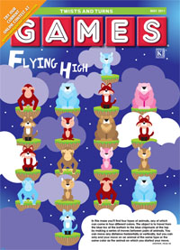
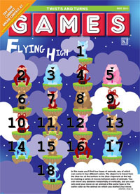

### The Problem

Flying High (Zoo Escape) is the cover puzzle of the [May 2011 Edition of
Games Magazine](http://www.gamesmagazine-online.com/indexMay11.html).

There are four animals, and four colors. Start at the blue fox at the
bottom and try to make your way up to the blue chipmunk at the top. Your
moves between animals can go any number of spaces horizontally or
vertically, but you can only go to an animal that is of the same type,
or has the same color. Let us annotate the image so we can talk about
where we are: 

So:

-   Start at 18
-   Moves to new positions if the conditions satisfy:
    -   Same Row or Same Column AND
    -   Same Animal or Same Color

-   Finish when you are at Space 1
-   If you are ever back on the same square, you have backtracked which
    means you made some unnecessary move.
-   This implies that the solution should be under 18 moves

### Human Solution

It seems that the human solution is actually the same as the computer
solution: Brute force, walking the tree of possibilities. Optionally you
can start from the end or the beginning.

### Computer Solution

My computer solution is coded in Python. It starts at square 18 and
recursively tries new possible destinations. It prunes possibility trees
if it is about to move to a space that it has been before. It also
prunes (returns) if it is about make a 19th move.

Output should look like this:

    (18, 3, 5, 17, 14, 16, 4, 2, 10, 6, 9, 7, 15, 11, 13, 12, 1) (18, 3, 5, 17, 14, 2, 10, 6, 9, 7, 15, 11, 13, 12, 1)

This is the official Solution
