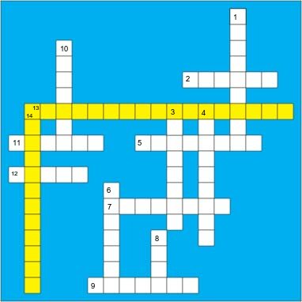

## Rules

"The object of this contest is to fill in the grid below, one letter per square, to form a complete set of 12 related items reading across and down, plus a description of the items reading first across and then down in the shaded (yellow) squares. Each item is a single word; the description is a five-word phrase with spaces between the words removed. This description is the answer to the contest.

The letters to be used appear below the grid, divided into two groups: letters in the 17 squares (both white and yellow) where across and down words cross, and letters in the squares (both white and yellow) that are only part of one word."

#### Letters in Squares Where Words Cross

    AAACEGHIMRRSSUUVZ

#### Letters in Other Squares

    AAAAAAAAAAABBBCCDEEEEEEEEEEFGGGIIIIIIILLLLL
    MNNNNNNOOOOOOOPPRRRRRSTTTTUUUUUUVYYY
